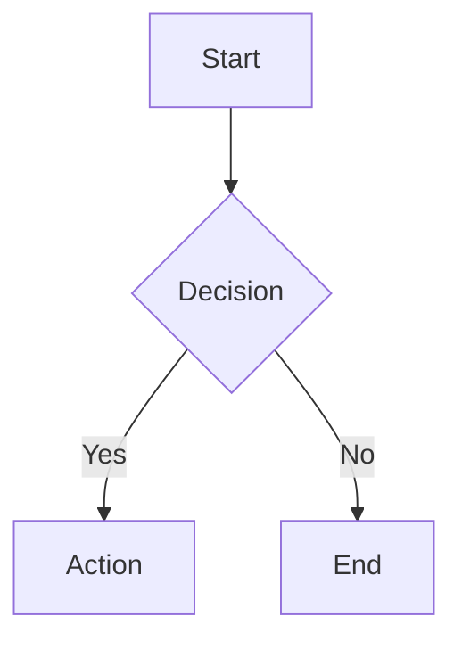

# Markdown Preview Pro

[](https://marketplace.visualstudio.com/items?itemName=luongnv89.markdown-preview-pro)
[](https://marketplace.visualstudio.com/items?itemName=luongnv89.markdown-preview-pro)
[](LICENSE)

A clean, minimal markdown preview for Visual Studio Code. Provides an enhanced markdown viewing experience with syntax highlighting, interactive diagrams, math rendering, real-time synchronization, and export capabilities.


## Installation

Search for **"Markdown Preview Pro"** in the VS Code Extensions sidebar (`Cmd+Shift+X` / `Ctrl+Shift+X`) and click **Install**.

Or install from the command line:

```bash
code --install-extension luongnv89.markdown-preview-pro
```

## Getting Started

1. Open any `.md` file in VS Code
2. Open the preview using one of these methods:
   - Press `Cmd+Shift+V` (macOS) or `Ctrl+Shift+V` (Windows/Linux)
   - Open the Command Palette (`Cmd+Shift+P` / `Ctrl+Shift+P`) and run **Markdown Preview Pro: Open Preview to Side**
   - Click the preview icon in the editor title bar
   - Right-click a markdown file and select **Open Preview to Side**

## Features

| Feature                   | Description                                                                          |
| ------------------------- | ------------------------------------------------------------------------------------ |
| Syntax Highlighting       | GitHub Dark theme, auto language detection, one-click copy                           |
| Mermaid Diagrams          | Flowcharts, sequence diagrams, and more via [Mermaid](https://mermaid.js.org/)       |
| Math Rendering            | Inline and block equations via [KaTeX](https://katex.org/)                           |
| Interactive Task Lists    | Toggle checkboxes in preview — syncs back to source file                             |
| Bidirectional Scroll Sync | Editor and preview scroll positions stay in sync                                     |
| Table of Contents         | Collapsible sidebar listing all headings with scroll-to and active section highlight |
| Word Count & Stats        | Bottom bar showing word count, character count, and estimated reading time           |
| Presentation Mode         | Splits content by `---` into slides with keyboard navigation                         |
| Theme Toggle              | Switch between light and dark preview independently from VS Code theme               |
| Export to HTML            | Standalone HTML file with diagrams and math fully rendered                           |
| Export to PDF             | PDF export using Chrome/Chromium                                                     |
| YAML Frontmatter          | Parse and display frontmatter as a styled, collapsible metadata card                 |
| Image Support             | Local, workspace-relative, absolute paths, and Excalidraw diagrams                   |
| Smart Typography          | Smart quotes, em-dashes, and other typographic enhancements                          |

### Syntax Highlighting

Code blocks are highlighted with the GitHub Dark theme and automatic language detection powered by highlight.js. A one-click copy button appears on every code block.

### Mermaid Diagrams

Write diagrams directly in your markdown using [Mermaid](https://mermaid.js.org/) syntax:

````markdown

````

### Math Rendering

Render math equations with [KaTeX](https://katex.org/):

- **Inline math**: `$E = mc^2$`
- **Block math**:
  ```
  $$
  \int_0^\infty e^{-x^2} dx = \frac{\sqrt{\pi}}{2}
  $$
  ```

### Interactive Task Lists

Toggle checkboxes directly in the preview — changes sync back to your source file automatically.

```markdown
- [x] Completed task
- [ ] Click to toggle in preview
```

### Bidirectional Scroll Sync

Editor and preview scroll positions stay in sync. Scroll in either pane and the other follows.

### Table of Contents Sidebar

Toggle a collapsible sidebar listing all headings in the document. Click any entry to smooth-scroll to that section. The active heading is highlighted as you scroll through the content.

### Word Count & Reading Stats

A bottom bar displays word count, character count, and estimated reading time (based on 200 wpm). Toggle it on or off from the toolbar.

### Presentation Mode

Turn any markdown document into a slide presentation. Content is split by `---` (horizontal rules) into individual slides. Navigate with arrow keys or Space, and press Escape to exit. A slide counter is shown at the bottom-right corner.

### Preview Toolbar

A floating toolbar in the top-right corner of the preview provides quick access to:

- **TOC toggle** — show or hide the Table of Contents sidebar
- **Stats toggle** — show or hide the word count and reading stats bar
- **Theme toggle** — switch between light and dark preview independently from your VS Code theme
- **Export to HTML** — generate a standalone HTML file with all diagrams and math fully rendered
- **Export to PDF** — export to PDF using Chrome/Chromium (must be installed on your system)
- **Presentation mode** — enter slide presentation mode
- **About** — view extension version and links

### YAML Frontmatter

YAML frontmatter between `---` delimiters is parsed and displayed as a collapsible metadata card at the top of the preview. Key-value pairs are shown in a clean table with clickable URLs, inline badge/image rendering, and array values as tags.

```markdown
---
title: My Document
author: Jane Doe
tags: [markdown, preview]
repository: https://github.com/example/repo
---
```

Set `showFrontmatter` to `"none"` to hide the card.

### Image Support

Local images, workspace-relative paths, absolute paths, and Excalidraw (`.excalidraw.svg`) diagrams are all supported.

### Smart Typography

Optional typographic enhancements: smart quotes, em-dashes, and other replacements.

## Configuration

All settings are under `markdownPreviewPro.*` in VS Code Settings:

| Setting            | Default | Description                           |
| ------------------ | ------- | ------------------------------------- |
| `scrollSync`       | `true`  | Bidirectional scroll synchronization  |
| `enableMermaid`    | `true`  | Mermaid diagram rendering             |
| `enableKatex`      | `true`  | KaTeX math rendering                  |
| `enableCheckboxes` | `true`  | Interactive task list checkboxes      |
| `typographer`      | `true`  | Smart quotes and typography           |
| `lineBreaks`       | `false` | Convert newlines to `<br>` tags       |
| `showFrontmatter`  | `card`  | Frontmatter display: `card` or `none` |

## Commands

Open the Command Palette (`Cmd+Shift+P` / `Ctrl+Shift+P`) and search for:

| Command                                      | Description                  |
| -------------------------------------------- | ---------------------------- |
| `Markdown Preview Pro: Open Preview`         | Open preview in current pane |
| `Markdown Preview Pro: Open Preview to Side` | Open preview in a side pane  |
| `Markdown Preview Pro: Export to HTML`       | Export as standalone HTML    |
| `Markdown Preview Pro: Export to PDF`        | Export as PDF                |

## Requirements

- **VS Code** >= 1.85.0
- **Chrome or Chromium** (only required for PDF export)

## Contributing

Contributions are welcome! See [CONTRIBUTING.md](CONTRIBUTING.md) for guidelines.

For development setup, see [docs/DEVELOPMENT.md](docs/DEVELOPMENT.md).

## Changelog

### 0.8.1

- Fix export timeout for documents with Mermaid diagrams
- Fix progress notification staying visible after export completes
- Increase export timeouts for complex documents
- Add landing page with dark/light mode toggle

### 0.8.0

- Add YAML frontmatter support with styled, collapsible metadata card
- Frontmatter renders key-value table with clickable links, inline badges, and array tags
- New `showFrontmatter` setting (`card` | `none`) to control display
- Scroll sync preserved via automatic line offset adjustment

### 0.7.0

- Add Table of Contents sidebar with heading navigation and active section highlighting
- Add word count, character count, and reading time stats bar
- Add presentation / slide mode with keyboard navigation
- Three new toolbar buttons: TOC toggle, Stats toggle, Presentation mode
- Toolbar separator between feature toggles and export actions

### 0.6.1

- Default preview theme is now light, independent of VS Code theme

### 0.6.0

- Add About button to preview toolbar

### 0.5.0

- Add floating toolbar with theme toggle, Export PDF, and Export HTML

### 0.4.0

- Fix local image rendering in webview preview

### 0.3.0

- Add export to HTML and PDF

### 0.2.0

- Add right-click context menu

### 0.1.0

- Initial release

See [changelog.md](changelog.md) for full details.

## License

MIT — see [LICENSE](LICENSE) for details.
