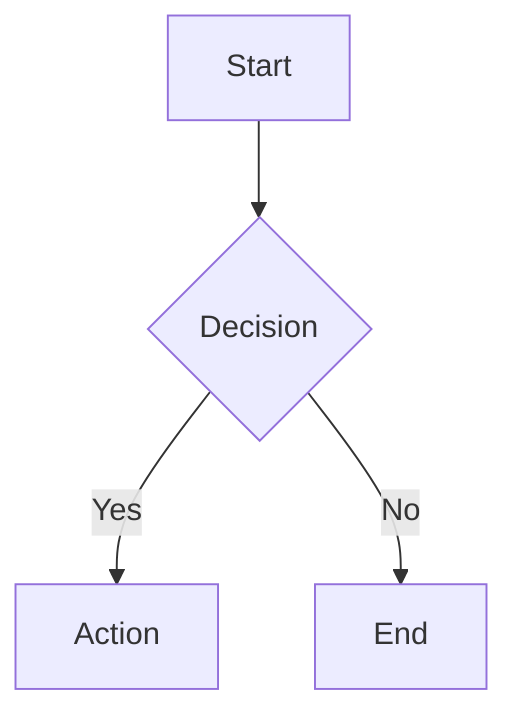

# Markdown Preview Pro

[](https://marketplace.visualstudio.com/items?itemName=luongnv89.markdown-preview-pro)
[](https://marketplace.visualstudio.com/items?itemName=luongnv89.markdown-preview-pro)
[](LICENSE)

A clean, minimal markdown preview for Visual Studio Code. Provides an enhanced markdown viewing experience with syntax highlighting, interactive diagrams, math rendering, real-time synchronization, and export capabilities.


## Installation

Search for **"Markdown Preview Pro"** in the VS Code Extensions sidebar (`Cmd+Shift+X` / `Ctrl+Shift+X`) and click **Install**.

Or install from the command line:

```bash
code --install-extension luongnv89.markdown-preview-pro
```

## Getting Started

1. Open any `.md` file in VS Code
2. Open the preview using one of these methods:
   - Press `Cmd+Shift+V` (macOS) or `Ctrl+Shift+V` (Windows/Linux)
   - Open the Command Palette (`Cmd+Shift+P` / `Ctrl+Shift+P`) and run **Markdown Preview Pro: Open Preview to Side**
   - Click the preview icon in the editor title bar
   - Right-click a markdown file and select **Open Preview to Side**

## Features

### Syntax Highlighting

Code blocks are highlighted with the GitHub Dark theme and automatic language detection powered by highlight.js. A one-click copy button appears on every code block.

### Mermaid Diagrams

Write diagrams directly in your markdown using [Mermaid](https://mermaid.js.org/) syntax:

````markdown

````

### Math Rendering

Render math equations with [KaTeX](https://katex.org/):

- **Inline math**: `$E = mc^2$`
- **Block math**:
  ```
  $$
  \int_0^\infty e^{-x^2} dx = \frac{\sqrt{\pi}}{2}
  $$
  ```

### Interactive Task Lists

Toggle checkboxes directly in the preview — changes sync back to your source file automatically.

```markdown
- [x] Completed task
- [ ] Click to toggle in preview
```

### Bidirectional Scroll Sync

Editor and preview scroll positions stay in sync. Scroll in either pane and the other follows.

### Preview Toolbar

A floating toolbar in the top-right corner of the preview provides quick access to:

- **Theme toggle** — switch between light and dark preview independently from your VS Code theme
- **Export to HTML** — generate a standalone HTML file with all diagrams and math fully rendered
- **Export to PDF** — export to PDF using Chrome/Chromium (must be installed on your system)
- **About** — view extension version and links

### Image Support

Local images, workspace-relative paths, absolute paths, and Excalidraw (`.excalidraw.svg`) diagrams are all supported.

### Smart Typography

Optional typographic enhancements: smart quotes, em-dashes, and other replacements.

## Configuration

All settings are under `markdownPreviewPro.*` in VS Code Settings:

| Setting            | Default | Description                          |
| ------------------ | ------- | ------------------------------------ |
| `scrollSync`       | `true`  | Bidirectional scroll synchronization |
| `enableMermaid`    | `true`  | Mermaid diagram rendering            |
| `enableKatex`      | `true`  | KaTeX math rendering                 |
| `enableCheckboxes` | `true`  | Interactive task list checkboxes     |
| `typographer`      | `true`  | Smart quotes and typography          |
| `lineBreaks`       | `false` | Convert newlines to `<br>` tags      |

## Commands

Open the Command Palette (`Cmd+Shift+P` / `Ctrl+Shift+P`) and search for:

| Command                                      | Description                  |
| -------------------------------------------- | ---------------------------- |
| `Markdown Preview Pro: Open Preview`         | Open preview in current pane |
| `Markdown Preview Pro: Open Preview to Side` | Open preview in a side pane  |
| `Markdown Preview Pro: Export to HTML`       | Export as standalone HTML    |
| `Markdown Preview Pro: Export to PDF`        | Export as PDF                |

## Requirements

- **VS Code** >= 1.85.0
- **Chrome or Chromium** (only required for PDF export)

## Contributing

Contributions are welcome! See [CONTRIBUTING.md](CONTRIBUTING.md) for guidelines.

For development setup, see [docs/DEVELOPMENT.md](docs/DEVELOPMENT.md).

## License

MIT — see [LICENSE](LICENSE) for details.
