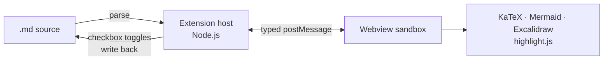
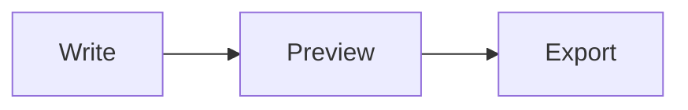
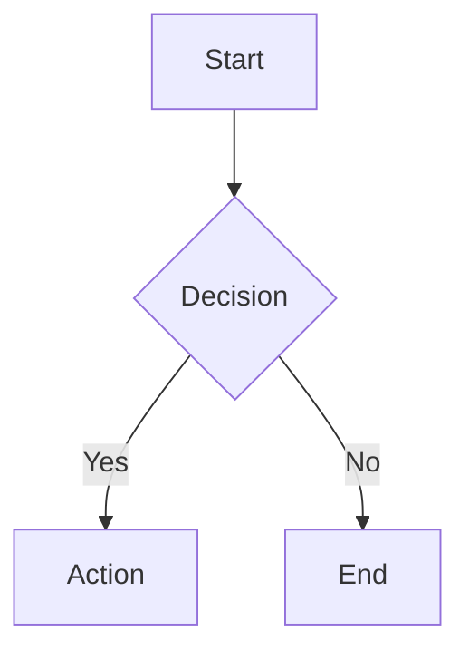

[](https://marketplace.visualstudio.com/items?itemName=luongnv89.markdown-preview-pro)
[](https://marketplace.visualstudio.com/items?itemName=luongnv89.markdown-preview-pro)
[](LICENSE)

# Markdown preview with diagrams, math, and export

Markdown Preview Pro renders Mermaid, Excalidraw, and KaTeX inline, writes checkbox toggles back to your source file, and exports to standalone HTML or PDF — all inside a sandboxed webview.


[**Install from the Marketplace ->**](https://marketplace.visualstudio.com/items?itemName=luongnv89.markdown-preview-pro) · [Landing page](https://luongnv.com/vscode-markdown-preview/) · [User guide](docs/USER_GUIDE.md)

## How It Works

The extension host parses markdown in Node.js; a sandboxed webview renders it. All traffic between them uses a typed `postMessage` protocol — the webview never touches the filesystem.



## Features

| Feature                | What you get                                           |
| ---------------------- | ------------------------------------------------------ |
| Syntax highlighting    | Auto language detection, light/dark theme, copy button |
| Mermaid diagrams       | Flowcharts and sequence diagrams rendered inline       |
| KaTeX math             | Inline `$...$` and block `$$...$$` equations           |
| Excalidraw             | `excalidraw` code blocks become SVG sketches           |
| Interactive task lists | Checkbox clicks write back to the source file          |
| Scroll sync            | Editor and preview positions stay locked both ways     |
| TOC + stats            | Heading sidebar, word count, reading time              |
| Presentation mode      | `---` splits the doc into keyboard-navigated slides    |
| Frontmatter card       | YAML frontmatter rendered as a styled metadata card    |
| Export                 | Standalone HTML or PDF, embedding only used runtimes   |
| Light/dark theme       | Preview theme toggles independently of VS Code         |

## Quick Start

Install (or search **Markdown Preview Pro** in the Extensions sidebar, `Ctrl+Shift+X` / `Cmd+Shift+X`):

```bash
code --install-extension luongnv89.markdown-preview-pro
```

Open any `.md` file and press `Ctrl+Shift+V` (`Cmd+Shift+V` on macOS) — or run **Markdown Preview Pro: Open Preview to Side** from the Command Palette.

## One File, Every Renderer

````markdown
- [x] Click me in the preview — I write back to this file

$$
\int_0^\infty e^{-x^2} dx = \frac{\sqrt{\pi}}{2}
$$


````

## vs. the Built-in Preview

| Capability                | Built-in preview    | Markdown Preview Pro  |
| ------------------------- | ------------------- | --------------------- |
| Mermaid + Excalidraw      | Extra extensions    | Built in              |
| KaTeX math                | Companion extension | Built in              |
| Clickable task checkboxes | Read-only           | Writes back to source |
| TOC sidebar + word stats  | —                   | Built in              |
| Presentation mode         | —                   | `---` slide splitting |
| HTML / PDF export         | —                   | Standalone file       |
| Independent preview theme | —                   | Light/dark toggle     |

## FAQ

**Does it replace VS Code's built-in preview?**
No. The extension registers its own `Ctrl+Shift+V` binding on markdown files (opens to the side); the built-in preview stays available through its own commands.

**What does PDF export need?**
Chrome or Chromium on your system. HTML export has no external dependency.

**Why are remote images off by default?**
A remote `https:` image would leak that the preview was opened and the viewer's IP. Opt in via `markdownPreviewPro.allowRemoteImages` — same policy as the built-in preview.

## Get Started

```bash
code --install-extension luongnv89.markdown-preview-pro
```

[Marketplace](https://marketplace.visualstudio.com/items?itemName=luongnv89.markdown-preview-pro) · [User guide](docs/USER_GUIDE.md) · [Architecture](docs/ARCHITECTURE.md) · [Contributing](CONTRIBUTING.md) · MIT Licensed

## Details

<details>
<summary><strong>Configuration</strong></summary>

All settings are under `markdownPreviewPro.*` in VS Code Settings:

| Setting             | Default | Description                                 |
| ------------------- | ------- | ------------------------------------------- |
| `scrollSync`        | `true`  | Bidirectional scroll synchronization        |
| `enableMermaid`     | `true`  | Mermaid diagram rendering                   |
| `enableKatex`       | `true`  | KaTeX math rendering                        |
| `enableExcalidraw`  | `true`  | Excalidraw diagram rendering                |
| `enableCheckboxes`  | `true`  | Interactive task list checkboxes            |
| `typographer`       | `true`  | Smart quotes and typography                 |
| `lineBreaks`        | `false` | Convert newlines to `<br>` tags             |
| `showFrontmatter`   | `card`  | Frontmatter display: `card` or `none`       |
| `allowRemoteImages` | `false` | Allow remote `https:` images in the preview |

</details>

<details>
<summary><strong>Commands</strong></summary>

Open the Command Palette (`Cmd+Shift+P` / `Ctrl+Shift+P`) and search for:

| Command                                      | Description                  |
| -------------------------------------------- | ---------------------------- |
| `Markdown Preview Pro: Open Preview`         | Open preview in current pane |
| `Markdown Preview Pro: Open Preview to Side` | Open preview in a side pane  |
| `Markdown Preview Pro: Export to HTML`       | Export as standalone HTML    |
| `Markdown Preview Pro: Export to PDF`        | Export as PDF                |

Other ways to open the preview: click the preview icon in the editor title bar, or right-click a markdown file and select **Open Preview to Side**.

</details>

<details>
<summary><strong>Feature details</strong></summary>

### Syntax Highlighting

Code blocks are highlighted with automatic language detection powered by highlight.js, in light and dark themes that follow the preview theme. A one-click copy button appears on every code block.

### Mermaid Diagrams

Write diagrams directly in your markdown using [Mermaid](https://mermaid.js.org/) syntax:

````markdown

````

### Math Rendering

Render math equations with [KaTeX](https://katex.org/):

- **Inline math**: `$E = mc^2$`
- **Block math**:
  ```
  $$
  \int_0^\infty e^{-x^2} dx = \frac{\sqrt{\pi}}{2}
  $$
  ```

### Interactive Task Lists

Toggle checkboxes directly in the preview — changes sync back to your source file automatically.

```markdown
- [x] Completed task
- [ ] Click to toggle in preview
```

### Bidirectional Scroll Sync

Editor and preview scroll positions stay in sync. Scroll in either pane and the other follows.

### Table of Contents Sidebar

Toggle a collapsible sidebar listing all headings in the document. Click any entry to smooth-scroll to that section. The active heading is highlighted as you scroll through the content.

### Word Count & Reading Stats

A bottom bar displays word count, character count, and estimated reading time (based on 200 wpm). Toggle it on or off from the toolbar.

### Presentation Mode

Turn any markdown document into a slide presentation. Content is split by `---` (horizontal rules) into individual slides. Navigate with arrow keys or Space, and press Escape to exit. A slide counter is shown at the bottom-right corner.

### Preview Toolbar

A floating toolbar in the top-right corner of the preview provides quick access to:

- **TOC toggle** — show or hide the Table of Contents sidebar
- **Stats toggle** — show or hide the word count and reading stats bar
- **Theme toggle** — switch between light and dark preview independently from your VS Code theme
- **Export to HTML** — generate a standalone HTML file with all diagrams and math fully rendered; a save dialog asks where to write the file (existing files are never overwritten silently) and the export can be cancelled from the progress notification
- **Export to PDF** — export to PDF using Chrome/Chromium (must be installed on your system); same save dialog and cancellable progress as HTML export
- **Presentation mode** — enter slide presentation mode
- **About** — view extension version and links

### YAML Frontmatter

YAML frontmatter between `---` delimiters is parsed and displayed as a collapsible metadata card at the top of the preview. Key-value pairs are shown in a clean table with clickable URLs, inline badge/image rendering, and array values as tags.

```markdown
---
title: My Document
author: Jane Doe
tags: [markdown, preview]
repository: https://github.com/example/repo
---
```

Set `showFrontmatter` to `"none"` to hide the card.

### Image Support

Local images, workspace-relative paths, absolute paths, and Excalidraw (`.excalidraw.svg`) diagrams are all supported.

### Smart Typography

Optional typographic enhancements: smart quotes, em-dashes, and other replacements.

</details>

<details>
<summary><strong>Requirements</strong></summary>

- **VS Code** >= 1.85.0
- **Chrome or Chromium** (only required for PDF export)

</details>

<details>
<summary><strong>Changelog</strong></summary>

### 0.9.4

- Fix PDF export title and header contrast — WCAG AAA (21:1) with print styles

### 0.9.3

- Fix syntax highlighting and diagram themes drifting out of sync with the preview theme toggle

### 0.9.2

- Resolve all npm audit vulnerabilities (mermaid, puppeteer-core, yaml, copy-webpack-plugin)

### 0.9.1

- Fix toolbar export buttons reaching no document while the webview holds focus

### 0.9.0

- Excalidraw diagram preview, theme-aware re-rendering, HTML/PDF export support

### 0.8.x

- Landing page with SEO/AI crawler support; export timeout and notification fixes

### 0.8.0

- YAML frontmatter support with styled, collapsible metadata card

### 0.7.0

- TOC sidebar, word count stats bar, presentation mode

### 0.6.x and earlier

- Theme toggle, floating toolbar, HTML/PDF export, context menu, initial release

See [changelog.md](changelog.md) for full details.

</details>

## License

MIT — see [LICENSE](LICENSE) for details.
