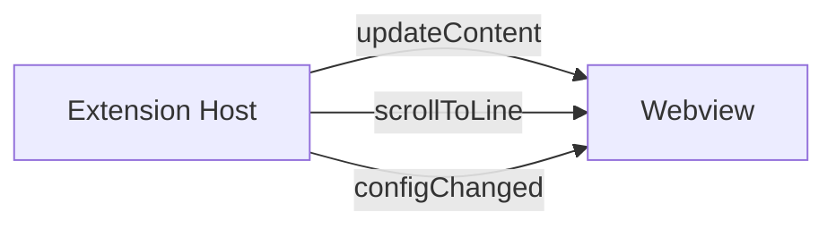
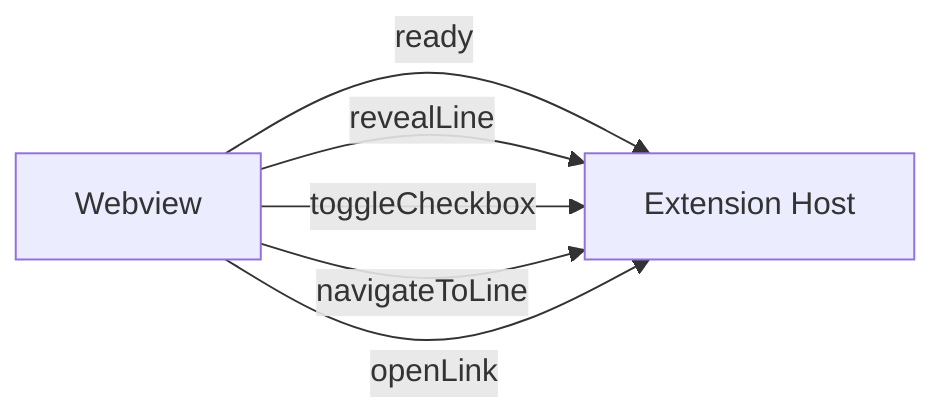

# API Reference

Internal API documentation for contributors working on the extension.

## Message Protocol

The extension host and webview communicate via VS Code's `postMessage` API. All message types are defined in `src/types/messages.ts`.

### Extension → Webview



#### `updateContent`

Sent when the markdown document changes. The extension renders markdown to HTML and sends the result.

```typescript
interface UpdateContentMessage {
  type: 'updateContent';
  html: string;          // Rendered HTML string
  documentUri: string;   // URI of the source document
  lineCount: number;     // Total lines in source document
}
```

#### `scrollToLine`

Sent when the editor scrolls, to sync the preview position.

```typescript
interface ScrollToLineMessage {
  type: 'scrollToLine';
  line: number;          // Target line number (0-based)
  source: 'editor';      // Always 'editor' for this direction
}
```

#### `configChanged`

Sent when `markdownPreviewPro.*` settings change.

```typescript
interface ConfigChangedMessage {
  type: 'configChanged';
  config: PreviewConfig;  // Full updated configuration
}
```

### Webview → Extension



#### `ready`

Sent once when the webview finishes loading. Triggers the initial content render.

```typescript
interface ReadyMessage {
  type: 'ready';
}
```

#### `revealLine`

Sent when the user scrolls the preview, to sync the editor position.

```typescript
interface RevealLineMessage {
  type: 'revealLine';
  line: number;          // Target line number (0-based)
  source: 'preview';     // Always 'preview' for this direction
}
```

#### `toggleCheckbox`

Sent when a user clicks a task list checkbox in the preview.

```typescript
interface ToggleCheckboxMessage {
  type: 'toggleCheckbox';
  line: number;           // Line number of the checkbox (0-based)
  checked: boolean;       // New checked state
}
```

#### `navigateToLine`

Sent when a user double-clicks a heading or element to jump to that line in the editor.

```typescript
interface NavigateToLineMessage {
  type: 'navigateToLine';
  line: number;           // Target line number (0-based)
}
```

#### `openLink`

Sent when a user clicks an external link (`http://` or `https://`).

```typescript
interface OpenLinkMessage {
  type: 'openLink';
  href: string;           // Full URL to open
}
```

### Configuration

```typescript
interface PreviewConfig {
  scrollSync: boolean;       // Bidirectional scroll synchronization
  enableMermaid: boolean;    // Mermaid diagram rendering
  enableKatex: boolean;      // KaTeX math rendering
  enableCheckboxes: boolean; // Interactive task list checkboxes
  lineBreaks: boolean;       // Convert \n to <br>
  typographer: boolean;      // Smart quotes and replacements
}
```

## Extension Host Classes

### `PreviewManager` (`src/previewManager.ts`)

Central class that manages the preview panel lifecycle and coordinates all extension-side logic.

| Method | Description |
|--------|-------------|
| `constructor(extensionUri)` | Initializes engine, scroll sync, and config |
| `showPreview(viewColumn)` | Opens or reveals the preview panel |
| `dispose()` | Cleans up all resources and event listeners |

**Event listeners registered:**
- `onDidReceiveMessage` - Handles all webview → extension messages
- `onDidChangeTextDocument` - Triggers debounced re-render (300ms)
- `onDidChangeActiveTextEditor` - Switches preview to new markdown file
- `onDidChangeTextEditorVisibleRanges` - Editor → preview scroll sync
- `onDidChangeConfiguration` - Reloads config and re-renders

### `MarkdownEngine` (`src/markdownEngine.ts`)

Configures and runs the markdown-it parser with all plugins.

| Method | Description |
|--------|-------------|
| `constructor(config)` | Creates markdown-it instance with plugins |
| `render(content): RenderResult` | Parses markdown string, returns `{ html }` |
| `setContext(documentUri, webview)` | Sets the document URI for resolving local images |
| `updateConfig(config)` | Recreates the engine with new configuration |

**Plugins configured:**
- Line number `data-line` attributes on block elements (for scroll sync)
- Task list checkboxes (if `enableCheckboxes`)
- KaTeX inline/block math (if `enableKatex`)
- Custom image resolver (local paths, Excalidraw)
- Syntax highlighting via highlight.js (skips `mermaid` blocks)

### `ScrollSync` (`src/scrollSync.ts`)

Prevents scroll feedback loops between editor and preview using a time-based lock (300ms).

| Method | Description |
|--------|-------------|
| `isLocked(): boolean` | Returns whether scroll sync is currently locked |
| `lock()` | Locks sync and schedules unlock after 300ms |
| `getEditorVisibleLine(editor): number` | Returns the first visible line of the editor |
| `revealEditorLine(editor, line)` | Scrolls the editor to show the target line |
| `dispose()` | Clears the lock timeout |

### `toggleCheckbox()` (`src/checkboxHandler.ts`)

```typescript
async function toggleCheckbox(
  document: TextDocument,
  line: number,
  checked: boolean
): Promise<void>
```

Finds the `[ ]` or `[x]` pattern on the given line and applies a workspace edit to toggle it. Supports `- [ ]`, `* [ ]`, and `+ [ ]` list markers.

### `getPreviewConfig()` (`src/utils/config.ts`)

Reads all `markdownPreviewPro.*` settings from VS Code workspace configuration and returns a `PreviewConfig` object.

### `resolveImageUri()` (`src/utils/uri.ts`)

```typescript
function resolveImageUri(
  src: string,
  documentUri: Uri,
  webview: Webview
): string
```

Resolves image `src` attributes:
- **Data URIs** (`data:`) - passed through unchanged
- **Absolute URLs** (`http://`, `https://`) - passed through unchanged
- **Relative paths** - resolved against the document's directory and converted to a webview-safe URI

## Webview Modules

### `renderer.ts`

| Function | Description |
|----------|-------------|
| `updateContent(html)` | Updates the DOM, renders Mermaid/KaTeX, refreshes copy buttons. Queues updates if one is already in progress. |
| `watchThemeChanges()` | Observes `class` attribute changes on `<body>` to detect VS Code theme switches and re-render Mermaid with the correct theme. |

### `scrollSync.ts`

| Function | Description |
|----------|-------------|
| `initScrollSync(vscode)` | Attaches scroll listener that posts `revealLine` messages (throttled to 50ms) |
| `scrollToLine(line)` | Finds the DOM element with matching `data-line` attribute and scrolls to it |

### `copyButton.ts`

| Function | Description |
|----------|-------------|
| `initCopyButtons()` | Initial setup (no-op, waits for `refreshCopyButtons`) |
| `refreshCopyButtons()` | Adds a "Copy" button to every `.code-block` element |

### `blockHighlighter.ts`

| Function | Description |
|----------|-------------|
| `initBlockHighlighter()` | Initial setup |
| `refreshBlockHighlighter()` | Attaches hover listeners to highlight active code blocks |

### `checkboxHandler.ts`

| Function | Description |
|----------|-------------|
| `initCheckboxHandler(vscode)` | Attaches click listener on checkboxes, posts `toggleCheckbox` messages |

### `navigationHandler.ts`

| Function | Description |
|----------|-------------|
| `initNavigationHandler(vscode)` | Attaches double-click listener on `[data-line]` elements (posts `navigateToLine`) and click listener on links (posts `openLink` for external URLs) |

## Commands

| Command ID | Title | Keybinding |
|-----------|-------|-----------|
| `markdownPreviewPro.showPreview` | Open Preview | - |
| `markdownPreviewPro.showPreviewToSide` | Open Preview to Side | `Cmd+Shift+V` / `Ctrl+Shift+V` |

## Related Docs

- [Architecture](ARCHITECTURE.md) - System design overview
- [Development](DEVELOPMENT.md) - How to set up and debug
