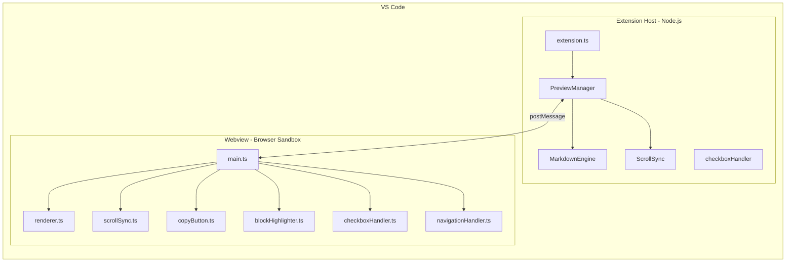
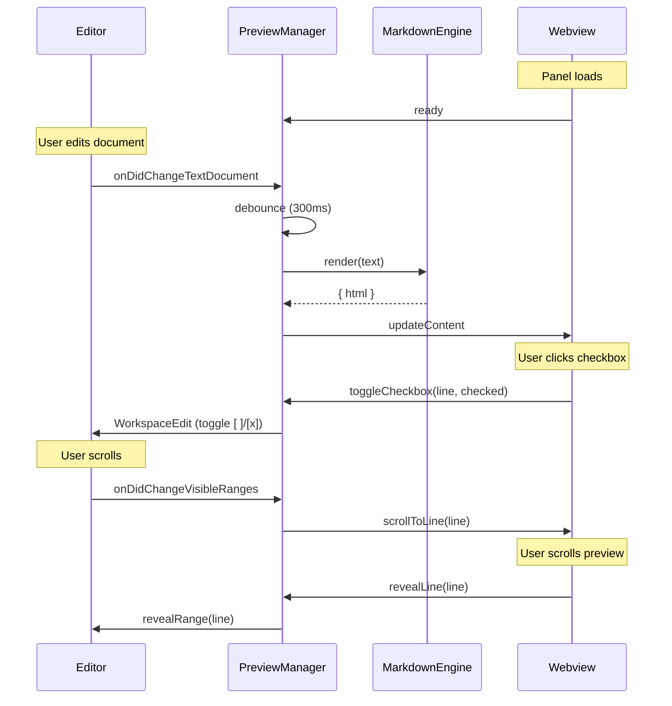
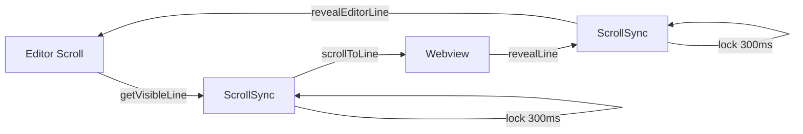
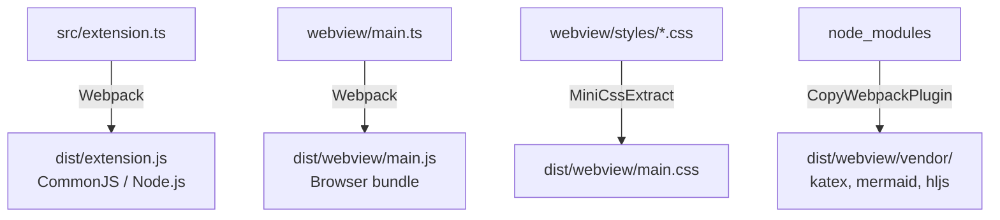

# Architecture

## Overview

Markdown Preview Pro is a VS Code extension that uses a **two-process architecture** to provide rich markdown preview capabilities.



## Extension Host (`src/`)

Runs in Node.js within VS Code's extension host process.

| File | Responsibility |
|------|---------------|
| `extension.ts` | Entry point, registers commands |
| `previewManager.ts` | Creates/manages webview panels, handles lifecycle |
| `markdownEngine.ts` | Configures markdown-it with plugins, renders markdown to HTML |
| `checkboxHandler.ts` | Syncs checkbox state changes back to the source document |
| `scrollSync.ts` | Calculates scroll positions from editor cursor |
| `utils/config.ts` | Reads VS Code configuration settings |
| `utils/uri.ts` | Resolves local image and resource URIs |

## Webview (`webview/`)

Runs in an isolated browser context (iframe) managed by VS Code.

| File | Responsibility |
|------|---------------|
| `main.ts` | Webview entry point, initializes all handlers |
| `renderer.ts` | Updates DOM, triggers Mermaid/KaTeX rendering |
| `scrollSync.ts` | Client-side scroll position tracking |
| `blockHighlighter.ts` | Highlights code blocks on hover |
| `copyButton.ts` | Adds copy-to-clipboard buttons to code blocks |
| `checkboxHandler.ts` | Captures checkbox clicks, sends messages to extension |
| `navigationHandler.ts` | Handles link clicks (internal navigation, external URLs) |

## Message Flow

Communication between extension host and webview uses VS Code's `postMessage` API. See [API Reference](API.md) for the full message protocol.



### Content Update

```
Editor Change → Debounce (300ms) → markdownEngine.render()
    → previewManager sends "updateContent" message
    → webview renderer updates DOM
    → Mermaid/KaTeX render client-side
```

### Scroll Sync

Bidirectional scroll sync with a 300ms lock to prevent feedback loops:



### Checkbox Toggle

```
User clicks checkbox in webview
    → checkboxHandler sends "toggleCheckbox" message with line number
    → extension finds the line in source document
    → toggles `[ ]` / `[x]` in the actual file
    → triggers content re-render
```

## Build System

Webpack bundles two separate entry points:



1. **Extension** (`src/extension.ts` → `dist/extension.js`) - CommonJS for Node.js
2. **Webview** (`webview/main.ts` → `dist/webview/main.js`) - Browser bundle with CSS
3. **Vendor files** - KaTeX, Mermaid, and highlight.js are copied to `dist/webview/vendor/`

CSS files are extracted via `mini-css-extract-plugin` into `dist/webview/main.css`.

## Security

The webview uses a strict Content Security Policy:

- `default-src 'none'` - Block everything by default
- `script-src 'nonce-...' 'unsafe-eval'` - Only nonced scripts (Mermaid needs `unsafe-eval`)
- `style-src ... 'unsafe-inline'` - Extension styles and inline styles
- `img-src ... https: data:` - Local images, HTTPS images, and data URIs
- `frame-src 'none'` - No iframes within the webview
- `worker-src 'none'` - No web workers

## Related Docs

- [API Reference](API.md) - Message protocol and class documentation
- [Development](DEVELOPMENT.md) - How to set up and debug
- [Deployment](DEPLOYMENT.md) - Building and publishing
