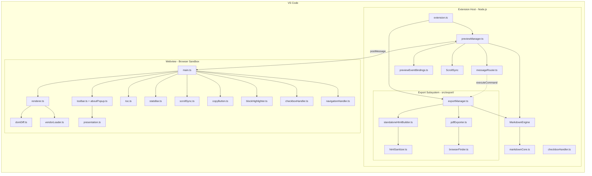
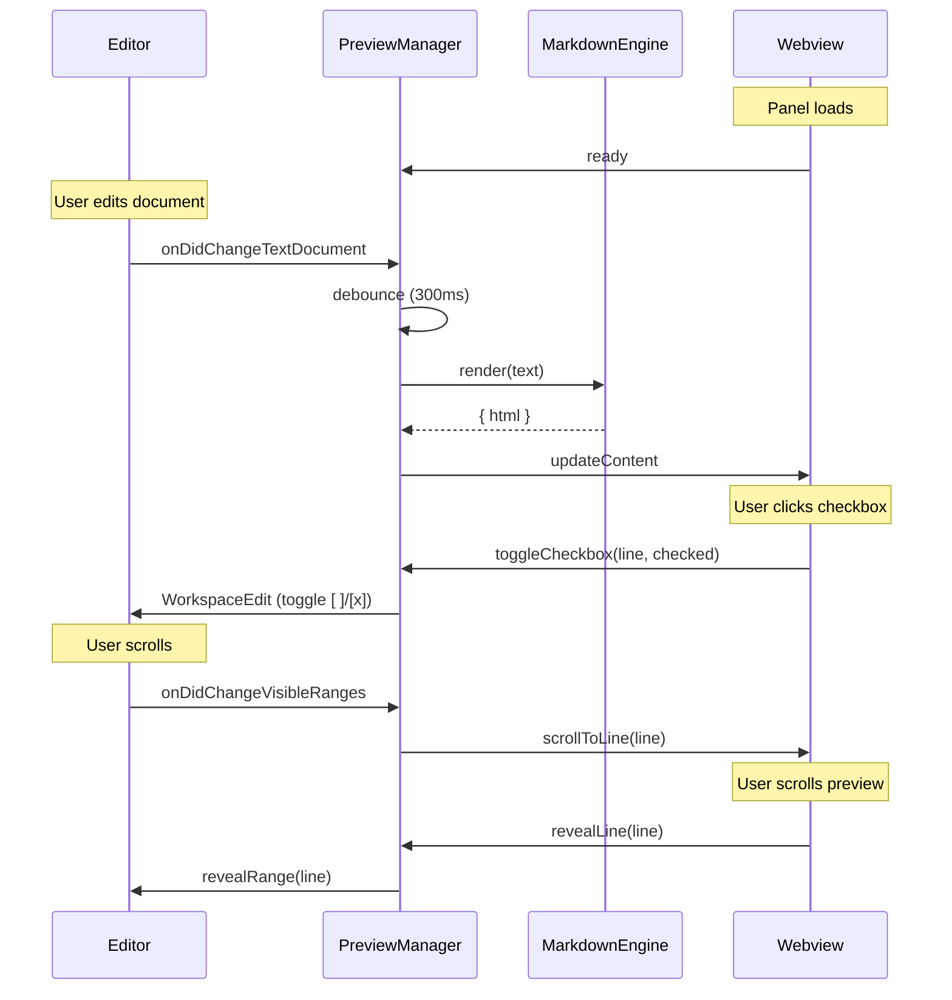
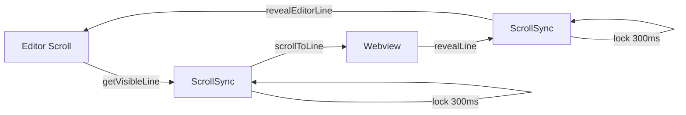
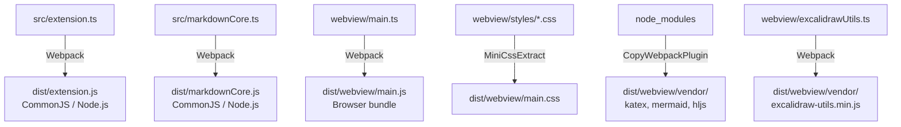

# Architecture

## Overview

Markdown Preview Pro is a VS Code extension that uses a **two-process architecture** to provide rich markdown preview capabilities.



## Extension Host (`src/`)

Runs in Node.js within VS Code's extension host process.

| File                                         | Responsibility                                                                                                                                                         |
| -------------------------------------------- | ---------------------------------------------------------------------------------------------------------------------------------------------------------------------- |
| `src/extension.ts`                           | Entry point: registers the `showPreview` / `showPreviewToSide` commands and owns the `PreviewManager` / `ExportManager` lifetimes                                      |
| `src/previewManager.ts`                      | Orchestrator: creates/manages webview panels, owns the preview lifecycle; implements `PreviewMessageContext` / `PreviewEventHost` and delegates to the modules below   |
| `src/messageRouter.ts`                       | Webview → extension dispatch table — the seven message handlers (`ready`, `revealLine`, `toggleCheckbox`, `navigateToLine`, `openLink`, `exportToPdf`, `exportToHtml`) |
| `src/previewEventBindings.ts`                | Registers the workspace/webview event subscriptions against the narrow `PreviewEventHost` interface                                                                    |
| `src/markdownEngine.ts`                      | Renders markdown to HTML; the vscode seam over the shared core (image URI resolution, frontmatter composition), rebuilt on config change via `ENGINE_CONFIG_KEYS`      |
| `src/markdownCore.ts`                        | vscode-free shared markdown-it pipeline — also compiled to `dist/markdownCore.js` for `scripts/generate-landing.cjs`                                                   |
| `src/checkboxHandler.ts`                     | Syncs checkbox state changes back to the source document                                                                                                               |
| `src/scrollSync.ts`                          | Calculates scroll positions from editor cursor / visible ranges; holds the 300 ms echo lock                                                                            |
| `src/hljsLanguages.ts`                       | Registers the ~28-language `highlight.js/lib/core` subset the preview highlights (bundle-slimming, #73)                                                                |
| `src/types/messages.ts`                      | Typed host↔webview message protocol (`ExtensionMessage` / `WebviewMessage` unions; mirrored in `webview/types/messages.ts`)                                            |
| `src/types/highlightjs-languages.d.ts`       | Ambient module declarations for the `highlight.js/lib/languages/*` grammar imports                                                                                     |
| `src/utils/config.ts`                        | Reads the `markdownPreviewPro` configuration settings                                                                                                                  |
| `src/utils/uri.ts`                           | Resolves local image and resource URIs with a path-containment guard                                                                                                   |
| `src/utils/aboutInfo.ts`                     | Lazily collects the About-popup metadata (package.json version/publisher/repo + `__GIT_COMMIT__` build-time SHA)                                                       |
| `src/utils/webviewHtml.ts`                   | Builds the webview HTML document shell — CSP meta, nonce, `data-*` About attributes                                                                                    |
| `src/utils/frontmatter.ts`                   | Parses the leading `---` YAML frontmatter block and renders it as a card                                                                                               |
| `src/utils/htmlEscape.ts`                    | The single HTML/attribute escaping helper used repo-wide                                                                                                               |
| `src/utils/previewHtmlGate.ts`               | Composes the webview document and content-gates the vendor `<script>` tags on what the render actually uses (#72)                                                      |
| `src/utils/vendorNeeds.ts`                   | Scans rendered markup for the features that need vendor runtimes (KaTeX, Mermaid, Excalidraw)                                                                          |
| `src/export/exportManager.ts`                | Registers `exportToHtml` / `exportToPdf` commands and orchestrates export with progress                                                                                |
| `src/export/standaloneHtmlBuilder.ts`        | Builds the self-contained exported HTML; embeds only the assets the sanitized markup needs                                                                             |
| `src/export/htmlSanitizer.ts`                | DOMPurify sanitization of rendered HTML before it reaches the export browser                                                                                           |
| `src/export/pdfExporter.ts`                  | PDF export; `puppeteer-core` stays a lazy `dist/*.extension.js` chunk behind `await import()`                                                                          |
| `src/export/browserFinder.ts`                | Locates an installed Chrome / Edge / Chromium binary per-OS for `puppeteer-core`                                                                                       |
| `src/test/runTest.ts`                        | Launches the Extension Development Host via `@vscode/test-electron`                                                                                                    |
| `src/test/suite/index.ts`                    | Mocha TDD suite entry point                                                                                                                                            |
| `src/test/fixtures/golden-render.md`         | Input markdown for the golden-output test                                                                                                                              |
| `src/test/fixtures/golden-render.html`       | Expected HTML for the golden-output test                                                                                                                               |
| `src/test/suite/browserFinder.test.ts`       | Mocha suite: `findChromePath`                                                                                                                                          |
| `src/test/suite/buildDeps.test.ts`           | Mocha suite: build-deps wave (#50, #51, #52)                                                                                                                           |
| `src/test/suite/checkboxHandler.test.ts`     | Mocha suite: `toggleCheckbox`                                                                                                                                          |
| `src/test/suite/depVersions.test.ts`         | Mocha suite: production dependency majors (#45, #46, #47)                                                                                                              |
| `src/test/suite/engineConfig.test.ts`        | Mocha suite: engine config gating (#76)                                                                                                                                |
| `src/test/suite/exportAssetGating.test.ts`   | Mocha suite: export asset gating (#74)                                                                                                                                 |
| `src/test/suite/exportOverwrite.test.ts`     | Mocha suite: export overwrite confirmation (#31)                                                                                                                       |
| `src/test/suite/exportSecurity.test.ts`      | Mocha suite: export pipeline JavaScript execution prevention (#25)                                                                                                     |
| `src/test/suite/extension.test.ts`           | Mocha suite: extension activation smoke tests                                                                                                                          |
| `src/test/suite/featureFlags.test.ts`        | Mocha suite: feature flags enableMermaid / enableExcalidraw (#32)                                                                                                      |
| `src/test/suite/frontmatter.test.ts`         | Mocha suite: `parseFrontmatter`                                                                                                                                        |
| `src/test/suite/goldenOutput.test.ts`        | Mocha suite: MarkdownEngine golden output (#46)                                                                                                                        |
| `src/test/suite/incrementalUpdate.test.ts`   | Mocha suite: incremental preview update patching (#77)                                                                                                                 |
| `src/test/suite/katexMath.test.ts`           | Mocha suite: katex 0.18 math rendering (#47)                                                                                                                           |
| `src/test/suite/landingPage.test.ts`         | Mocha suite: landing page build (#71, #78)                                                                                                                             |
| `src/test/suite/landingStructure.test.ts`    | Mocha suite: generate-landing structure (#60)                                                                                                                          |
| `src/test/suite/mermaidRender.test.ts`       | Mocha suite: mermaid 12 diagram rendering (#45)                                                                                                                        |
| `src/test/suite/messageRouter.test.ts`       | Mocha suite: webview message router (#62)                                                                                                                              |
| `src/test/suite/pdfExport.test.ts`           | Mocha suite: PDF export (#44)                                                                                                                                          |
| `src/test/suite/previewUx.test.ts`           | Mocha suite: rendering placeholder + readable diagram errors (#68)                                                                                                     |
| `src/test/suite/previewVendorGating.test.ts` | Mocha suite: preview vendor gating (#72)                                                                                                                               |
| `src/test/suite/rawHtmlImages.test.ts`       | Mocha suite: MarkdownEngine raw-HTML image rewriting (#35)                                                                                                             |
| `src/test/suite/rendererCache.test.ts`       | Mocha suite: webview renderer diagram cache (#75)                                                                                                                      |
| `src/test/suite/resourceContainment.test.ts` | Mocha suite: path containment helpers (#27)                                                                                                                            |
| `src/test/suite/sharedEngine.test.ts`        | Mocha suite: shared engine parity (#54)                                                                                                                                |
| `src/test/suite/syntaxHighlight.test.ts`     | Mocha suite: syntax highlighting language subset (#73)                                                                                                                 |
| `src/test/suite/toolbarUx.test.ts`           | Mocha suite: preview toolbar UX (#66, #67, #69)                                                                                                                        |
| `src/test/suite/uri.test.ts`                 | Mocha suite: `resolveImageUri`                                                                                                                                         |
| `src/test/suite/webviewModules.test.ts`      | Mocha suite: webview copyButton module (#65)                                                                                                                           |
| `src/test/suite/webviewSecurity.test.ts`     | Mocha suite: preview webview security (#26, #29)                                                                                                                       |

## Webview (`webview/`)

Runs in an isolated browser context (iframe) managed by VS Code.

| File                              | Responsibility                                                                                                                                        |
| --------------------------------- | ----------------------------------------------------------------------------------------------------------------------------------------------------- |
| `webview/main.ts`                 | Entry point: imports all styles, initializes every handler, dispatches host messages                                                                  |
| `webview/renderer.ts`             | `updateContent` — applies the incoming HTML via incremental patching, runs Mermaid/KaTeX/Excalidraw renders, watches theme changes                    |
| `webview/domDiff.ts`              | Incremental DOM patch (#77): diffs top-level blocks by signature and replaces only changed regions, keeping live nodes, observers and rendered output |
| `webview/vendorLoader.ts`         | Lazy vendor loading (#72): injects the vendor `<script>` a newly-rendered feature needs when the initial page did not ship it                         |
| `webview/toolbar.ts`              | Preview toolbar — theme toggle, TOC and stats toggles, HTML/PDF export, presentation mode, About — with aria labels                                   |
| `webview/aboutPopup.ts`           | About popup; renders the extension metadata via `textContent` only                                                                                    |
| `webview/domUtils.ts`             | Shared DOM helpers (`createButton`, …)                                                                                                                |
| `webview/icons.ts`                | Inline SVG icon set for the toolbar                                                                                                                   |
| `webview/theme.ts`                | Theme detection: follow the VS Code host theme until the toolbar pins a persisted light/dark overlay                                                  |
| `webview/toc.ts`                  | Table-of-contents sidebar built from the rendered headings; entry clicks call `scrollToLine`                                                          |
| `webview/presentation.ts`         | Presentation-mode overlay — `<hr>` slide breaks, keyboard navigation                                                                                  |
| `webview/scrollSync.ts`           | Preview-side scroll tracking; throttled `revealLine` reporting with an echo guard                                                                     |
| `webview/copyButton.ts`           | Copy-to-clipboard buttons on code blocks                                                                                                              |
| `webview/statsBar.ts`             | Word/character counts and reading-time estimate bar                                                                                                   |
| `webview/blockHighlighter.ts`     | Highlights the topmost visible block on scroll via `IntersectionObserver`                                                                             |
| `webview/checkboxHandler.ts`      | Captures checkbox clicks, sends `toggleCheckbox` to the extension host                                                                                |
| `webview/navigationHandler.ts`    | Link clicks (internal navigation, external URLs) and double-click → `navigateToLine` source navigation                                                |
| `webview/excalidrawUtils.ts`      | Vendor entry bundling ESM-only `@excalidraw/utils` to `dist/webview/vendor/excalidraw-utils.min.js`, exposing `window.ExcalidrawUtils`                |
| `webview/types/messages.ts`       | Webview mirror of the typed message protocol                                                                                                          |
| `webview/types/vscode.d.ts`       | `acquireVsCodeApi` typings (`VsCodeApi`)                                                                                                              |
| `webview/types/globals.d.ts`      | Ambient globals and `window` augmentations for the vendor bundles                                                                                     |
| `webview/types/assets.d.ts`       | Asset module declarations (stylesheet imports, …)                                                                                                     |
| `webview/styles/main.css`         | Base preview layout and styles                                                                                                                        |
| `webview/styles/markdown.css`     | Markdown element styles                                                                                                                               |
| `webview/styles/code.css`         | Code block styling                                                                                                                                    |
| `webview/styles/highlight.css`    | Syntax-highlighting theme                                                                                                                             |
| `webview/styles/mermaid.css`      | Mermaid diagram styling                                                                                                                               |
| `webview/styles/excalidraw.css`   | Excalidraw embed styling                                                                                                                              |
| `webview/styles/frontmatter.css`  | Frontmatter card styling                                                                                                                              |
| `webview/styles/toolbar.css`      | Toolbar styles                                                                                                                                        |
| `webview/styles/toc.css`          | TOC sidebar styles                                                                                                                                    |
| `webview/styles/statsBar.css`     | Stats bar styles                                                                                                                                      |
| `webview/styles/presentation.css` | Presentation-mode styles                                                                                                                              |

## Message Flow

Communication between extension host and webview uses VS Code's `postMessage` API. See [API Reference](API.md) for the full message protocol.



### Content Update

```
Editor Change → Debounce (300ms) → markdownEngine.render()
    → previewManager sends "updateContent" message
    → webview renderer patches the DOM incrementally (domDiff.ts):
      top-level blocks are diffed against the last render by signature and
      only changed regions are replaced — kept blocks retain their nodes,
      observers, and rendered output
    → Mermaid/KaTeX render client-side inside the changed regions; rendered
      diagrams are cached by source hash so untouched diagrams are not
      re-rendered on the next update
    → vendorLoader.ts lazily injects a vendor <script> when newly-rendered
      markup needs a runtime the initial page did not ship
```

### Scroll Sync

Bidirectional scroll sync with a 300ms lock to prevent feedback loops:



### Checkbox Toggle

```
User clicks checkbox in webview
    → checkboxHandler sends "toggleCheckbox" message with line number
    → extension finds the line in source document
    → toggles `[ ]` / `[x]` in the actual file
    → triggers content re-render
```

### HTML / PDF Export

```
User runs "Export to HTML" / "Export to PDF" (command palette or preview toolbar)
    → exportManager renders the document through its own MarkdownEngine
    → htmlSanitizer (DOMPurify) strips script-capable markup from the output
    → HTML: standaloneHtmlBuilder emits a self-contained file whose embedded
      assets are gated on the sanitized markup
    → PDF: pdfExporter lazily loads the puppeteer-core chunk and prints via a
      Chrome/Edge binary located by browserFinder
```

## Build System

Webpack bundles three entry points:



1. **Extension** (`src/extension.ts` → `dist/extension.js`) - CommonJS for Node.js. Only the activation path is bundled here: the export-only heavyweights `jsdom` and `puppeteer-core` sit behind `await import()` and emit as separate lazy `dist/<id>.extension.js` chunks, `require()`d on first export use (issue #73). Syntax highlighting registers a ~28-language subset via `highlight.js/lib/core` (`src/hljsLanguages.ts`) rather than the full ~190-grammar package.
2. **Shared engine** (`src/markdownCore.ts` → `dist/markdownCore.js`) - CommonJS for Node.js; `require()`d by `scripts/generate-landing.cjs` so the landing page renders through the same pipeline
3. **Webview** (`webview/main.ts` → `dist/webview/main.js`) - Browser bundle with CSS
4. **Vendor files** - KaTeX, Mermaid, and highlight.js are copied to `dist/webview/vendor/`; `@excalidraw/utils` (ESM-only since 0.1.4) is bundled there by webpack from a thin wrapper that exposes `window.ExcalidrawUtils`

CSS files are extracted via `mini-css-extract-plugin` into `dist/webview/main.css`.

## Security

The webview uses a strict Content Security Policy:

- `default-src 'none'` - Block everything by default
- `script-src 'nonce-...'` - Only nonced scripts (Mermaid 12.x renders without `eval`/`new Function` under `securityLevel: 'strict'`, so `unsafe-eval` is not granted)
- `style-src ... 'unsafe-inline'` - Extension styles and inline styles
- `img-src ... data:` - Local webview images and data URIs; remote `https:` images are blocked unless `markdownPreviewPro.allowRemoteImages` is enabled
- `frame-src 'none'` - No iframes within the webview
- `worker-src 'none'` - No web workers

Extension metadata (`version`, `commit`, `publisher`, `repo`) reaches the
webview through `<body data-*>` attributes that are attribute-escaped on write,
and the About popup renders them with `textContent` — never `innerHTML`.

Exported documents get their own CSP (`src/export/standaloneHtmlBuilder.ts`):
only the extension's nonced scripts may run, and no network loads other than
images are permitted. Before that, `src/export/htmlSanitizer.ts` strips
author-supplied markup (`<script>`, event handlers, `javascript:` URLs,
embedding elements) out of the rendered HTML.

## Related Docs

- [API Reference](API.md) - Message protocol and class documentation
- [Development](DEVELOPMENT.md) - How to set up and debug
- [Deployment](DEPLOYMENT.md) - Building and publishing
