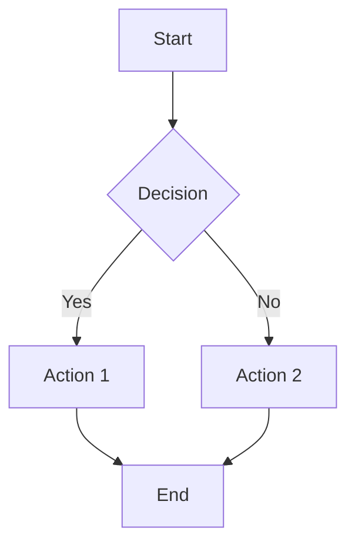
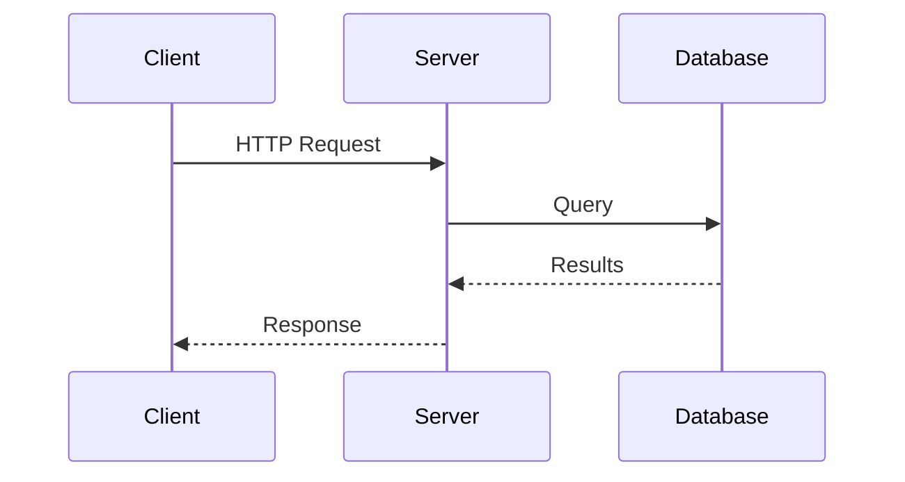
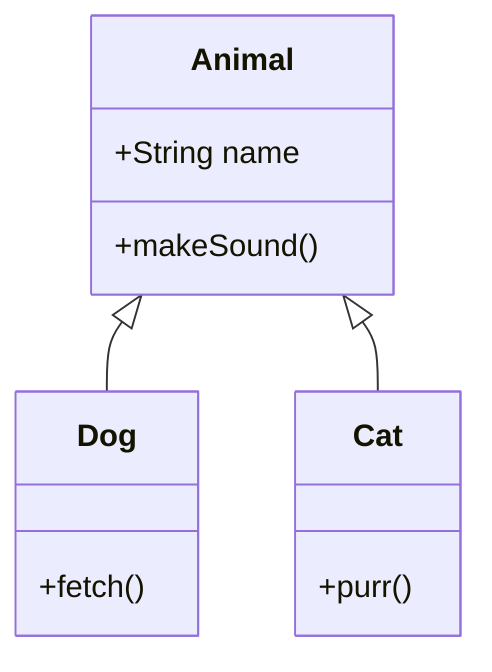
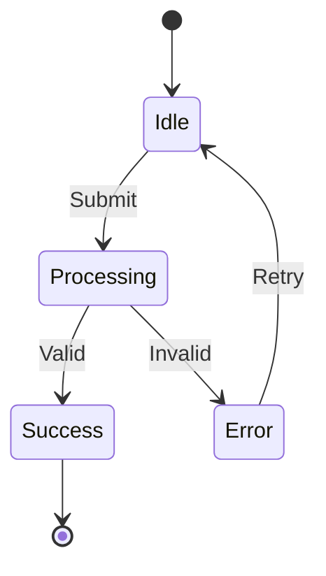
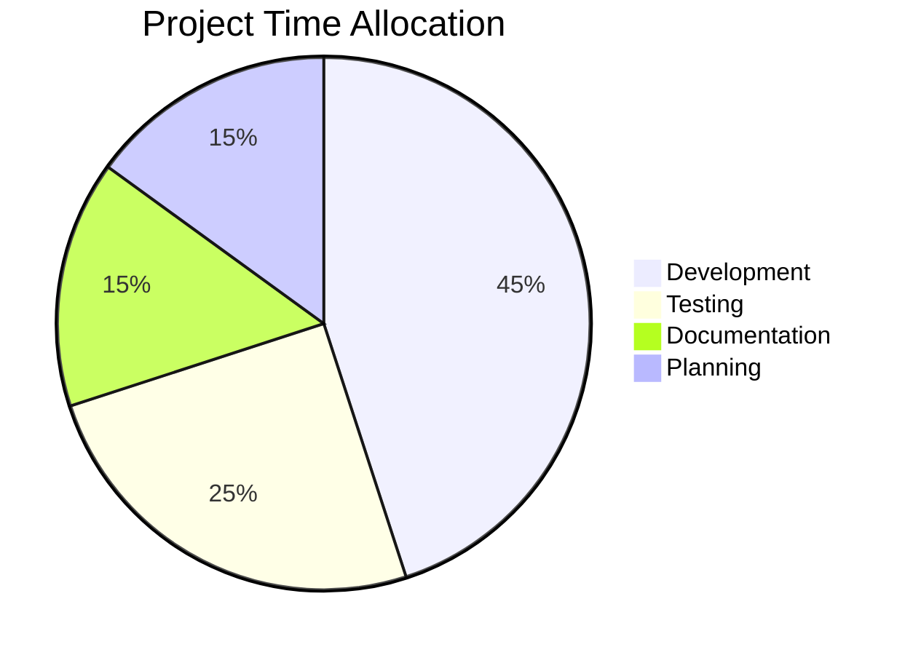
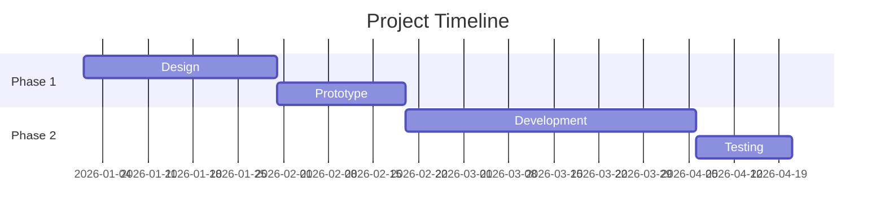

# User Guide

A comprehensive guide to all features in Markdown Preview Pro.

## Getting Started

Open any `.md` file and press `Cmd+Shift+V` (macOS) or `Ctrl+Shift+V` (Windows/Linux) to open the preview side by side.

You can also:

- Use the Command Palette: **Markdown Preview Pro: Open Preview to Side**
- Click the preview icon in the editor title bar

## Syntax Highlighting

Code blocks are highlighted automatically using highlight.js with the GitHub Dark theme.

Specify a language for best results:

````markdown
```python
def hello():
    print("Hello, world!")
```
````

Auto-detection works for unlabeled code blocks, but explicitly specifying the language is faster and more accurate.

**Supported languages:** All languages supported by [highlight.js](https://highlightjs.org/download) including Python, JavaScript, TypeScript, Go, Rust, C/C++, Java, SQL, Bash, and 180+ more.

### Copy Button

Every code block has a **Copy** button in the top-right corner. Click it to copy the code to your clipboard.

## Mermaid Diagrams

Use fenced code blocks with the `mermaid` language to render diagrams.

### Flowchart

````markdown

````

### Sequence Diagram

````markdown

````

### Class Diagram

````markdown

````

### State Diagram

````markdown

````

### Pie Chart

````markdown

````

### Gantt Chart

````markdown

````

For the full syntax reference, see the [Mermaid documentation](https://mermaid.js.org/intro/).

**Theme:** Diagrams automatically adapt to your VS Code theme (dark or light).

## KaTeX Math

### Inline Math

Wrap expressions in single dollar signs:

```markdown
The formula $E = mc^2$ shows mass-energy equivalence.
```

### Block Math

Wrap expressions in double dollar signs, each on their own line:

```markdown
$$
\int_0^\infty e^{-x^2} dx = \frac{\sqrt{\pi}}{2}
$$
```

### Common Examples

| Syntax                                           | Result        |
| ------------------------------------------------ | ------------- |
| `$x^2$`                                          | Superscript   |
| `$x_i$`                                          | Subscript     |
| `$\frac{a}{b}$`                                  | Fraction      |
| `$\sqrt{x}$`                                     | Square root   |
| `$\sum_{i=1}^{n} i$`                             | Summation     |
| `$\alpha, \beta, \gamma$`                        | Greek letters |
| `$\mathbf{v}$`                                   | Bold vector   |
| `$\begin{pmatrix} a & b \\ c & d \end{pmatrix}$` | Matrix        |

For the full function list, see [KaTeX Supported Functions](https://katex.org/docs/supported).

## Task Lists

Create interactive checklists using standard markdown syntax:

```markdown
- [x] Completed task
- [ ] Pending task
- [ ] Another pending task
```

**Click a checkbox** in the preview to toggle it. The change is written back to the source file automatically.

Supported list markers: `-`, `*`, `+`

## Scroll Sync

When enabled, scrolling in either the editor or the preview will sync the other:

- **Editor → Preview:** Scroll the editor and the preview follows
- **Preview → Editor:** Scroll the preview and the editor follows

A 300ms lock prevents feedback loops. Disable via `markdownPreviewPro.scrollSync: false`.

## Images

### Relative Paths

Use paths relative to the markdown file:

```markdown


```

### Remote Images

```markdown

```

### Excalidraw

Reference exported Excalidraw files:

```markdown


```

## Smart Typography

When `typographer` is enabled (default), markdown-it applies:

| Input      | Output         |
| ---------- | -------------- |
| `"quotes"` | "smart quotes" |
| `'single'` | 'smart single' |
| `--`       | en-dash        |
| `---`      | em-dash        |
| `...`      | ellipsis       |

Disable via `markdownPreviewPro.typographer: false`.

## Configuration Reference

Open VS Code Settings and search for `markdownPreviewPro`:

### `scrollSync` (default: `true`)

Enable bidirectional scroll synchronization between editor and preview.

### `enableMermaid` (default: `true`)

Enable Mermaid diagram rendering. Disable for faster rendering on large files without diagrams.

### `enableKatex` (default: `true`)

Enable KaTeX math rendering. Inline `$...$` and block `$$...$$` syntax.

### `enableCheckboxes` (default: `true`)

Enable interactive task list checkboxes. When enabled, clicking a checkbox in the preview updates the source file.

### `typographer` (default: `true`)

Enable smart quotes and typographic replacements (em-dash, en-dash, ellipsis).

### `lineBreaks` (default: `false`)

Convert single newlines in paragraphs to `<br>` tags. By default, adjacent lines are joined into a single paragraph (standard markdown behavior).

## Keyboard Shortcuts

| Action               | macOS         | Windows/Linux  |
| -------------------- | ------------- | -------------- |
| Open Preview to Side | `Cmd+Shift+V` | `Ctrl+Shift+V` |
| Open Command Palette | `Cmd+Shift+P` | `Ctrl+Shift+P` |

## Tips

- **Navigate to source:** Double-click any element in the preview to jump to its line in the editor
- **Code blocks:** Specify the language for faster, more accurate syntax highlighting
- **Large files:** Disable Mermaid if you don't use diagrams to speed up rendering
- **Theme switching:** Mermaid diagrams automatically re-render when you change your VS Code theme

## Related Docs

- [Troubleshooting](TROUBLESHOOTING.md) - Common issues and fixes
- [Configuration](../README.md#configuration) - Quick settings reference
