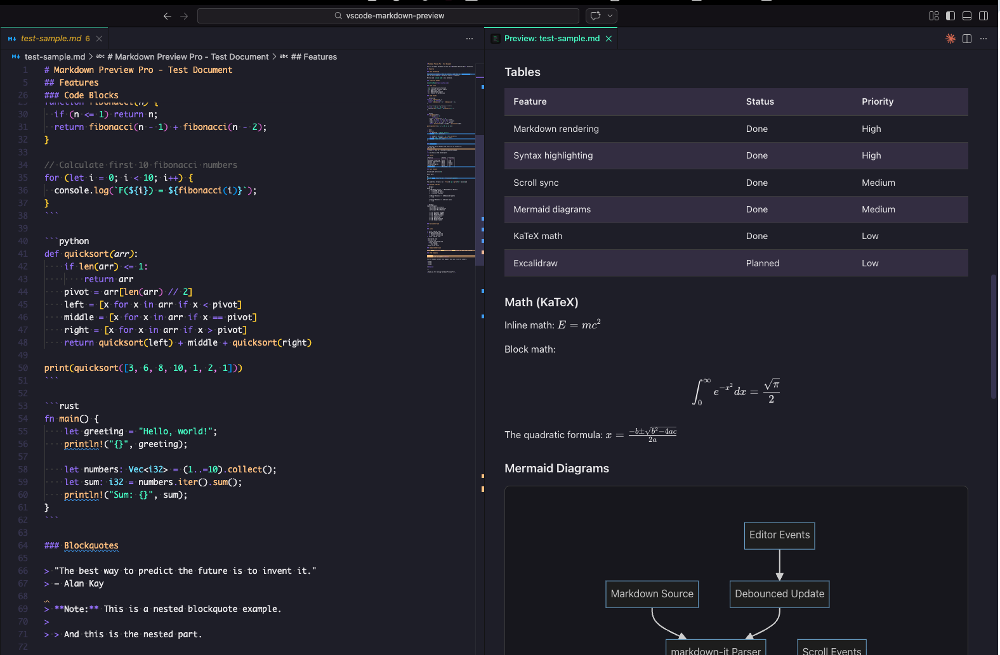
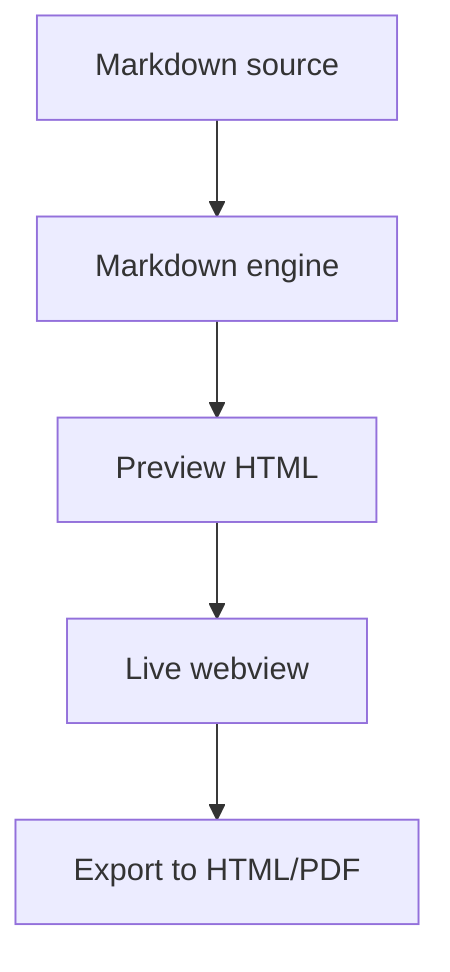

# Markdown Preview Pro

A clean, minimal markdown preview for Visual Studio Code — built for people who want markdown to look good, stay readable, and support real authoring features like diagrams, math, task lists, and standalone export.

> **Note:** This page is the exact output of generating a single Markdown file into a single standalone HTML file using this extension's own rendering/export pipeline.

[Install from Marketplace](https://marketplace.visualstudio.com/items?itemName=luongnv89.markdown-preview-pro) · [View on GitHub](https://github.com/luongnv89/vscode-markdown-preview) · [Read the User Guide](https://github.com/luongnv89/vscode-markdown-preview/blob/main/docs/USER_GUIDE.md)



## Why this extension exists

VS Code already has a markdown preview, but sometimes you want something sharper:

- cleaner rendering
- better syntax highlighting
- Mermaid diagram support
- KaTeX math rendering
- interactive task lists
- export to standalone HTML and PDF
- a preview designed to feel lightweight instead of cluttered

**Markdown Preview Pro** is built around that idea.

## Core features

| Feature                | What it does                                                            |
| ---------------------- | ----------------------------------------------------------------------- |
| Syntax highlighting    | Renders fenced code blocks with highlighted syntax and readable styling |
| Mermaid diagrams       | Supports flowcharts, sequence diagrams, and other Mermaid blocks        |
| KaTeX math             | Renders inline and block math formulas                                  |
| Interactive task lists | Lets task lists behave like real checkboxes inside preview              |
| Export to HTML         | Generates a standalone HTML document                                    |
| Export to PDF          | Exports using Chrome / Chromium                                         |
| Frontmatter card       | Parses YAML frontmatter into a styled metadata card                     |
| Image support          | Handles local images and common markdown image flows                    |

## Installation

### From VS Code Marketplace

Search for **Markdown Preview Pro** in the Extensions view and click **Install**.

### From CLI

```bash
code --install-extension luongnv89.markdown-preview-pro
```

### Requirements

- VS Code `>= 1.85.0`
- Chrome or Chromium only if you want PDF export

## Commands

| Command                                      | Description                      |
| -------------------------------------------- | -------------------------------- |
| `Markdown Preview Pro: Open Preview`         | Open preview in the current pane |
| `Markdown Preview Pro: Open Preview to Side` | Open preview beside the editor   |
| `Markdown Preview Pro: Export to HTML`       | Export a standalone HTML file    |
| `Markdown Preview Pro: Export to PDF`        | Export to PDF                    |

## Rendering showcase

This section intentionally demonstrates the different markdown elements and rich content types the extension renders.

### Text styles

This is regular text with **bold**, _italic_, **_bold italic_**, ~~strikethrough~~, and `inline code`.

You can also render links like [GitHub](https://github.com/luongnv89/vscode-markdown-preview) and mix inline formatting with normal prose.

### Ordered and unordered lists

1. Open a markdown file
2. Launch preview to the side
3. Edit while watching the preview update
4. Export if you need a shareable artifact

- Clean rendering
- Minimal chrome
- Useful features
  - Mermaid
  - KaTeX
  - task lists

### Interactive task lists

- [x] Syntax highlighting
- [x] Mermaid support
- [x] KaTeX support
- [x] Frontmatter card
- [ ] Your next markdown-heavy project

### Blockquotes

> Good preview tooling should disappear into the background and let the content do the work.

> **Nested note:** this renderer also handles nested blockquote structure.
>
> > Yep, including this part.

### Table rendering

| Element     | Why it matters        |
| ----------- | --------------------- |
| Headings    | Clear hierarchy       |
| Code blocks | Technical readability |
| Tables      | Compact structure     |
| Quotes      | Visual separation     |
| Lists       | Scannability          |

### Horizontal rule

---

### Images


### Keyboard keys and inline HTML

Press <kbd>Ctrl</kbd>+<kbd>Shift</kbd>+<kbd>V</kbd> to open preview to the side.

<details>
<summary>Click to expand an HTML details block</summary>

This content is inside a native HTML disclosure block, rendered as part of the markdown preview.

- It can include lists
- paragraphs
- and other inline markdown content

</details>

### TypeScript code block

```ts
interface PreviewConfig {
  scrollSync: boolean;
  enableMermaid: boolean;
  enableKatex: boolean;
  enableCheckboxes: boolean;
}

const config: PreviewConfig = {
  scrollSync: true,
  enableMermaid: true,
  enableKatex: true,
  enableCheckboxes: true,
};

console.log('Preview ready', config);
```

### Python code block

```python
def render_markdown(name: str, features: list[str]) -> str:
    joined = ", ".join(features)
    return f"{name} supports: {joined}"

print(render_markdown("Markdown Preview Pro", ["Mermaid", "KaTeX", "HTML export"]))
```

### JSON code block

```json
{
  "name": "markdown-preview-pro",
  "publisher": "luongnv89",
  "features": ["preview", "mermaid", "math", "export"]
}
```

### Mermaid diagram



### KaTeX math

Inline math looks like this: $E = mc^2$

Block math:

$$
\int_0^\infty e^{-x^2} dx = \frac{\sqrt{\pi}}{2}
$$

## Configuration snapshot

| Setting                               | Default | Description                            |
| ------------------------------------- | ------- | -------------------------------------- |
| `markdownPreviewPro.scrollSync`       | `true`  | Bidirectional scroll synchronization   |
| `markdownPreviewPro.enableMermaid`    | `true`  | Enable Mermaid rendering               |
| `markdownPreviewPro.enableKatex`      | `true`  | Enable math rendering                  |
| `markdownPreviewPro.enableCheckboxes` | `true`  | Enable interactive checkboxes          |
| `markdownPreviewPro.typographer`      | `true`  | Enable smart typography                |
| `markdownPreviewPro.lineBreaks`       | `false` | Convert new lines to `<br>`            |
| `markdownPreviewPro.showFrontmatter`  | `card`  | Show YAML frontmatter as a styled card |

## Open source

- License: **MIT**
- Publisher: **luongnv89**
- Repo: [luongnv89/vscode-markdown-preview](https://github.com/luongnv89/vscode-markdown-preview)
- Marketplace: [Markdown Preview Pro](https://marketplace.visualstudio.com/items?itemName=luongnv89.markdown-preview-pro)

If you want a markdown preview that feels more polished without turning into a kitchen-sink monster, this extension is built for exactly that.

[Install Markdown Preview Pro](https://marketplace.visualstudio.com/items?itemName=luongnv89.markdown-preview-pro)
