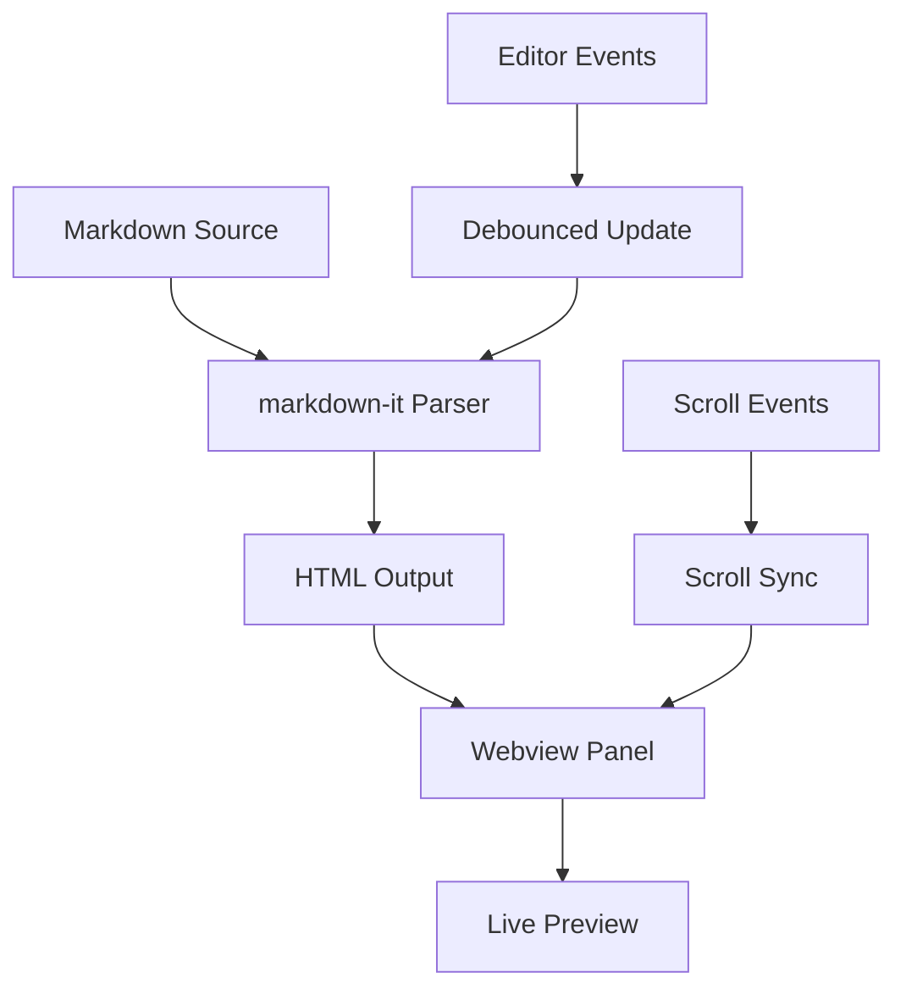
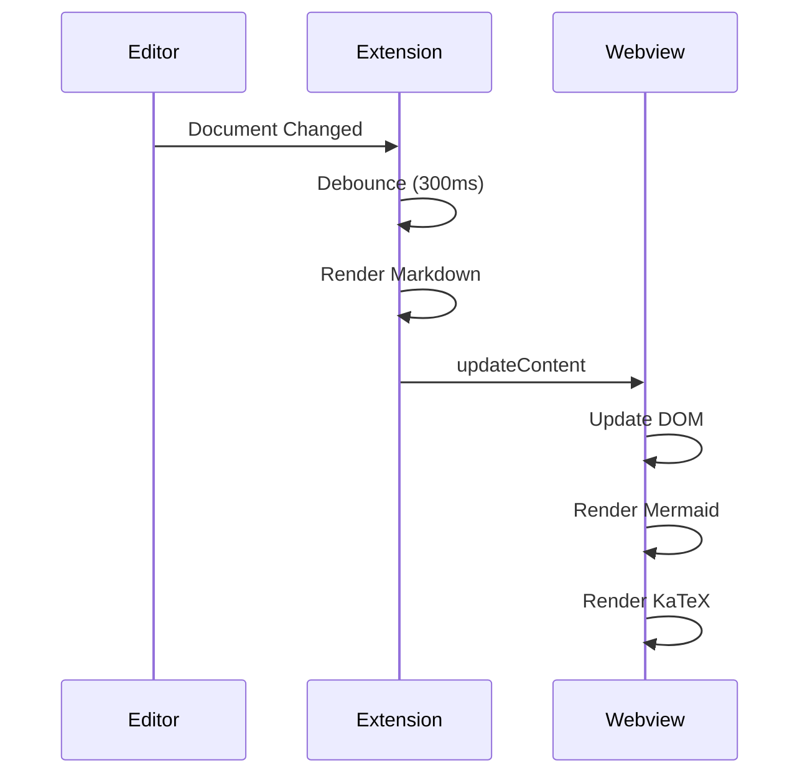

# Markdown Preview Pro - Test Document

This is a sample document to test the **Markdown Preview Pro** extension.

## Features

### Text Formatting

This text is **bold**, this is _italic_, and this is ~~strikethrough~~.
You can also combine **_bold and italic_** together.

Here's some `inline code` in a sentence.

### Links and Images

[Visit GitHub](https://github.com)

### Task Lists

- [x] Create project structure
- [x] Implement markdown engine
- [ ] Add scroll sync
- [ ] Add mermaid support
- [ ] Publish to marketplace

### Code Blocks

```javascript
function fibonacci(n) {
  if (n <= 1) return n;
  return fibonacci(n - 1) + fibonacci(n - 2);
}

// Calculate first 10 fibonacci numbers
for (let i = 0; i < 10; i++) {
  console.log(`F(${i}) = ${fibonacci(i)}`);
}
```

```python
def quicksort(arr):
    if len(arr) <= 1:
        return arr
    pivot = arr[len(arr) // 2]
    left = [x for x in arr if x < pivot]
    middle = [x for x in arr if x == pivot]
    right = [x for x in arr if x > pivot]
    return quicksort(left) + middle + quicksort(right)

print(quicksort([3, 6, 8, 10, 1, 2, 1]))
```

```rust
fn main() {
    let greeting = "Hello, world!";
    println!("{}", greeting);

    let numbers: Vec<i32> = (1..=10).collect();
    let sum: i32 = numbers.iter().sum();
    println!("Sum: {}", sum);
}
```

### Blockquotes

> "The best way to predict the future is to invent it."
> — Alan Kay

> **Note:** This is a nested blockquote example.
>
> > And this is the nested part.

### Tables

| Feature             | Status  | Priority |
| ------------------- | ------- | -------- |
| Markdown rendering  | Done    | High     |
| Syntax highlighting | Done    | High     |
| Scroll sync         | Done    | Medium   |
| Mermaid diagrams    | Done    | Medium   |
| KaTeX math          | Done    | Low      |
| Excalidraw          | Planned | Low      |

### Math (KaTeX)

Inline math: $E = mc^2$

Block math:

$$
\int_0^\infty e^{-x^2} dx = \frac{\sqrt{\pi}}{2}
$$

The quadratic formula: $x = \frac{-b \pm \sqrt{b^2 - 4ac}}{2a}$

### Mermaid Diagrams





### Horizontal Rule

---

### Lists

1. First ordered item
2. Second ordered item
   1. Nested ordered item
   2. Another nested item
3. Third ordered item

- Unordered item
- Another item
  - Nested unordered item
  - More nesting
    - Even deeper
- Back to top level

### Keyboard Shortcuts

Press <kbd>Ctrl</kbd>+<kbd>Shift</kbd>+<kbd>V</kbd> to open the preview.

### HTML Elements

<details>
<summary>Click to expand</summary>

This is hidden content that appears when you click the summary.

- Item 1
- Item 2
- Item 3

</details>

---

_Thank you for testing Markdown Preview Pro!_
